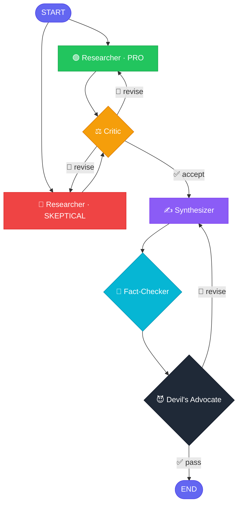

# 🧠 Multi-Agent Research System

> A six-agent LangGraph pipeline that argues with itself. Parallel pro/skeptical researchers, structured rubric critique, chain-of-verification fact-checking, and an adversarial devil's advocate — all on free-tier APIs.

[](https://www.python.org/)
[](https://github.com/langchain-ai/langgraph)
[](https://ai.google.dev/)
[](https://groq.com/)
[](#)

---

## ✨ What It Does

Ask the system any research question. Instead of one model giving you one answer, **six specialized agents debate, verify, and red-team** the response before you see it.

- 🟢 **Two researchers fan out in parallel** — one looking for supporting evidence, one looking for limitations and counter-evidence
- ⚖️ **A critic** evaluates both with a structured 1-5 rubric and can send them back
- ✍️ **A synthesizer** mediates the two viewpoints into one balanced answer
- 🔎 **A fact-checker** extracts atomic claims and verifies each against the research and the live web
- 😈 **A devil's advocate** red-teams the answer for hidden assumptions and missing perspectives
- 🔁 If either reviewer flags issues, the synthesizer **revises** until everyone is satisfied (or the iteration cap kicks in)

The judgment agents run on **Groq's Qwen3-32B** (a reasoning model) while the generation agents run on **Gemini 3.1 Flash-Lite** — intentionally different model families so they have independent training biases. No more Gemini judging Gemini.

---

## 🏗️ Architecture



**Two feedback loops, both capped at 2 iterations:**
- `Critic → researchers` (re-fans-out to both in parallel)
- `Fact-Checker / Devil's Advocate → Synthesizer`

---

## 🤖 The Agents

| Agent | Model | Tools | Role |
|---|---|---|---|
| 🟢 **Researcher · PRO** | Gemini 3.1 Flash-Lite | Web, RAG, Python REPL | Finds supporting evidence, mechanisms, applications |
| 🔴 **Researcher · SKEPTICAL** | Gemini 3.1 Flash-Lite | Web, RAG, Python REPL | Finds limitations, counter-evidence, controversies |
| ⚖️ **Critic** | Groq Qwen3-32B | RAG (for independent verification) | Rubric scoring: `relevance`, `completeness`, `source_quality`, `balance` (1-5 each); revise if any < 3 |
| ✍️ **Synthesizer** | Gemini 3.1 Flash-Lite | – | Mediator: explicitly reconciles PRO + SKEPTICAL |
| 🔎 **Fact-Checker** | Groq Qwen3-32B | Web search (mandatory) | Chain-of-Verification: extracts 3-7 atomic claims, marks each `supported` / `verified` / `unsupported` / `contradicted` |
| 😈 **Devil's Advocate** | Groq Qwen3-32B | – | Red-team: finds hidden assumptions, ignored audiences, framing bias, missing topics |

---

## 🚀 Quick Start

### 1. Clone & install

```powershell
git clone <your-repo-url>
cd "Multi-Agent System"
pip install -r requirements.txt
```

### 2. Configure secrets

```powershell
cp .env.example .env
# Then edit .env and fill in:
#   GOOGLE_API_KEY=AIza...      (required — for Gemini)
#   GROQ_API_KEY=gsk_...        (required — for Qwen3 judges)
#   TAVILY_API_KEY=tvly-...     (optional — falls back to DuckDuckGo)
```

🔑 **Get the keys:**
- Gemini: https://aistudio.google.com/apikey
- Groq: https://console.groq.com/keys
- Tavily (optional): https://tavily.com/

### 3. Run

| Goal | Command |
|---|---|
| One-shot CLI query | `python -m src.main "What is retrieval-augmented generation?"` |
| Pretty Streamlit UI | `streamlit run src/app.py` |
| Arcade Pygame GUI | `python -m src.arcade` |
| Render the graph | `python -m src.visualize static` |
| Evaluation harness | `python -m src.evaluation.evaluate` |
| Tests (no API calls) | `python -m pytest tests/ -v` |

### 4. (Optional) Add a corpus for RAG

Drop any PDFs into `data/corpus/` and the system automatically:
- Builds a FAISS index using `sentence-transformers/all-MiniLM-L6-v2` (local, ~90 MB, one-time download)
- Saves the index to `data/vectorstore/` for reuse
- Enumerates the PDF names in the retriever tool description so the LLM knows what's available

If `data/corpus/` is empty, RAG is silently disabled and the researchers fall back to web search only.

---

## 📁 Project Structure

```
Multi-Agent System/
├── 📄 CLAUDE.md                  Reference for AI assistants & devs
├── 📄 README.md                  You are here
├── 📄 requirements.txt
├── 🔐 .env                       Secrets (gitignored)
├── 📄 .env.example
│
├── 📂 src/
│   ├── __init__.py               🛡️  truststore SSL patch (Windows AV bypass)
│   ├── main.py                   🖥️  CLI entry point
│   ├── app.py                    🎨  Streamlit UI
│   ├── visualize.py              📊  Mermaid graph renderer
│   ├── state.py                  📦  AgentState + parallel-write reducer
│   ├── config.py                 ⚙️  Models, timers, RAG settings
│   ├── graph.py                  🔗  LangGraph wiring
│   │
│   ├── 📂 agents/
│   │   ├── _common.py            🔧  Shared helpers
│   │   ├── researcher.py         🟢🔴 PRO + SKEPTICAL researchers
│   │   ├── critic.py             ⚖️  Rubric judge
│   │   ├── synthesizer.py        ✍️  Mediator
│   │   ├── fact_checker.py       🔎  Chain-of-Verification
│   │   └── devils_advocate.py    😈  Red-team
│   │
│   ├── 📂 conflict/
│   │   └── resolution.py         🔀  Conditional edge routers
│   │
│   ├── 📂 tools/
│   │   ├── web_search.py         🌐  Tavily → DuckDuckGo fallback
│   │   ├── rag.py                📚  FAISS + local embeddings
│   │   └── code_exec.py          🐍  Sandboxed Python REPL
│   │
│   └── 📂 evaluation/
│       ├── baseline.py           ⚪  Single-agent control
│       ├── evaluate.py           📈  Pipeline vs baseline harness
│       └── queries.json          🧪  Test queries + expected facts
│
├── 📂 docs/
│   ├── architecture.md
│   ├── theory_mapping.md         🎓  BDI / FIPA / Contract Net mapping
│   └── graph.md                  📊  Auto-generated diagram
│
├── 📂 data/
│   ├── corpus/                   📄  Your PDFs go here
│   └── vectorstore/              🗂️  FAISS index (auto-generated)
│
└── 📂 tests/
    └── test_graph.py             ✅  Structural tests, no API calls
```

---

## 🔄 How It Works

### 1. Parallel Fan-Out (Contract Net Protocol)

The query is announced to **two researcher agents simultaneously**. Each gets the same tools (web search, RAG, Python REPL) but a different prompt angle — one is told to find supporting evidence, the other to find counter-evidence and limitations. This is the **task-announcement** phase of CNP.

Both researchers run in parallel via LangGraph's native parallel-branch support, so they can each make multiple tool calls without blocking each other.

### 2. Structured Critique (FIPA accept-proposal / reject-proposal)

The Critic receives both research outputs and scores them on a four-dimensional rubric:

```
relevance       1-5  → Does the research address the original query?
completeness    1-5  → Are both perspectives substantively developed?
source_quality  1-5  → Are claims attributed to identifiable sources?
balance         1-5  → Is the pro/skeptical split substantive?
```

If **any** dimension scores below 3, the Critic emits a FIPA `reject-proposal` (verdict = `revise`) and the task is **re-announced to both researchers** in parallel with the feedback attached. Otherwise it's `accept-proposal` and the pipeline advances.

The Critic itself has access to the RAG tool — it can independently spot-check claims against the local corpus rather than just trusting what the researchers wrote. **Information asymmetry by design.**

### 3. Mediation, Not Restatement

The Synthesizer is **not a re-stater of a single research output**. It receives two viewpoints that may genuinely conflict, and its role is explicitly mediator: surface points of agreement, acknowledge tensions, give the user a balanced picture.

### 4. Chain-of-Verification

The Fact-Checker decomposes the synthesis into atomic claims, then verifies each one against (a) the research findings and (b) the live web. Each claim gets a status:

| Status | Meaning |
|---|---|
| ✅ `supported` | Backed by research findings |
| 🌐 `verified` | Independently confirmed via web search |
| ❌ `unsupported` | No backing found |
| ⚠️ `contradicted` | Active contradiction found |

If any claim is `unsupported` or `contradicted`, the verdict is `revise` and the synthesizer must address the specific issues.

### 5. Adversarial Red-Team

The Devil's Advocate runs **after** the Fact-Checker. By that point the factual claims are already verified — DA's job is structural: hidden assumptions, ignored audiences, framing bias, important counterexamples that aren't covered. Looking for things a sharp critic would attack.

If DA flags ≥2 substantive weaknesses, the Synthesizer revises (subject to iteration cap).

---

## 🛠️ Tech Stack

| Layer | Choice | Why |
|---|---|---|
| **Orchestration** | LangGraph | Native parallel branches, conditional routing, state reducers |
| **Generation LLM** | Gemini 3.1 Flash-Lite | 15 RPM free tier — handles the fan-out load |
| **Judgment LLM** | Groq Qwen3-32B | Different model family from Gemini → independent biases; 30 RPM free; very fast |
| **Embeddings** | sentence-transformers/all-MiniLM-L6-v2 | Local — sidesteps Windows TLS interception issues with cloud embedding APIs |
| **Vector store** | FAISS-CPU | ~200 MB RAM; persisted to disk for reuse |
| **Web search** | Tavily → DuckDuckGo | Tavily is higher quality; DDG is the no-key fallback |
| **PDF loading** | PyPDFLoader | Pages + metadata preserved |
| **Tracing** | LangSmith | Optional; env vars only |
| **TLS bridge** | truststore | Patches Python SSL to use OS cert store on Windows |
| **UI** | Streamlit | Quick to set up, per-agent expanders, rubric metric cards |

**All free tier.** No credit card required for any service.

---

## 🎓 Theory Mapping

This is an academic project for a Master's course. Each architectural decision maps to a specific multi-agent theory:

### 🧩 Belief-Desire-Intention (BDI)

Each agent has implicit BDI structure encoded in its prompt + state:
- **Beliefs**: research findings, retrieved corpus passages, web search results
- **Desires**: the system prompt's goal (find evidence / critique / mediate / verify)
- **Intentions**: the tool-call sequence the agent commits to during execution

### 🤝 FIPA ACL (Agent Communication Language)

State transitions implement FIPA speech acts:
- `inform` → research findings passed from researchers to critic
- `propose` → synthesizer's draft answer
- `accept-proposal` / `reject-proposal` → critic and fact-checker verdicts
- `failure` (implicit) → max-iteration termination

### 📜 Contract Net Protocol (CNP)

The fan-out / re-fan-out pattern is a literal Contract Net:
1. **Announcement**: query is announced to both researchers in parallel
2. **Bidding**: each researcher produces findings (their "bid")
3. **Award**: critic evaluates and either accepts (forwards to synthesizer) or re-announces to the cohort
4. **Aggregation of multiple judges**: post-synthesis, Fact-Checker and Devil's Advocate both review — any `reject-proposal` triggers another revision round

See [`docs/theory_mapping.md`](docs/theory_mapping.md) for the full mapping.

---

## 📊 Evaluation

Compare the multi-agent pipeline against a **single-agent baseline** (same Gemini model, same tools, one prompt):

```powershell
python -m src.evaluation.evaluate                # string-match scoring
python -m src.evaluation.evaluate --llm-judge    # Gemini Flash-Lite as judge
```

Scores 4 dimensions, 0-5 each:
- 📌 **Correctness** — how many expected `key_facts` are present
- 📋 **Completeness** — depth and breadth
- 📖 **Coherence** — readability and organization
- 🚫 **Hallucination penalty** — unsupported claims (inverted: 5 = none)

Results saved to `evaluation_results.json` + comparison table printed to stdout.

Add or edit test queries in `src/evaluation/queries.json`.

---

## ⚙️ Configuration

All knobs in [`src/config.py`](src/config.py):

| Setting | Default | Notes |
|---|---|---|
| `GENERATION_MODEL` | `gemini-3.1-flash-lite` | Researchers + Synthesizer |
| `JUDGMENT_MODEL` | `qwen/qwen3-32b` | Critic + Fact-Checker + Devil's Advocate |
| `EVAL_MODEL` | `gemini-3.1-flash-lite` | LLM-as-judge in eval harness |
| `MODEL_TEMPERATURE` | `1.0` | Gemini 2.5+ degrades below 1.0 |
| `MAX_ITERATIONS` | `2` | Per feedback loop |
| `RATE_LIMIT_SLEEP` | `2` seconds | Between LLM calls in agents |
| `EMBEDDING_MODEL` | `sentence-transformers/all-MiniLM-L6-v2` | Local |
| `CHUNK_SIZE` / `CHUNK_OVERLAP` | `1000` / `200` | RAG splitter |

---

## 🩹 Known Issues & Workarounds

### Windows + HTTPS-scanning AV (Kaspersky / ESET / Avast / Bitdefender)

These products intercept TLS connections and re-sign them with a substitute CA. Python ≥ 3.13 rejects some of these substitute certs as malformed (`Basic Constraints of CA cert not marked critical`), breaking cloud embedding APIs.

**Workaround applied:**
- `src/__init__.py` runs `truststore.inject_into_ssl()` at import time so Python uses the OS cert store (which contains the AV's CA).
- Embeddings switched from cloud (Gemini) to local (sentence-transformers).

If you're on a corporate network where this still breaks, exclude `*.huggingface.co` from your AV's HTTPS scanning.

### Free-tier rate limits

- Gemini 3.1 Flash-Lite: 15 RPM. Fan-out + tool-call rounds + synthesis can use 8-12 calls per query. `RATE_LIMIT_SLEEP=2` keeps you under cap.
- Groq Qwen3-32B: 30 RPM. Three sequential judge calls per query — well under.
- Long evaluation sweeps: keep your test set ≤ 8 queries.

### Stale vector store after changing the embedding model

The FAISS index encodes vector dimensions. If you change `EMBEDDING_MODEL`, **delete `data/vectorstore/`** or similarity search will silently return garbage.

---

## 🧪 Testing

Structural tests live in `tests/test_graph.py` and run in ~30s with no API calls:

```powershell
python -m pytest tests/ -v
```

Covers:
- ✅ Graph compiles
- ✅ Critic router: accept / revise-fan-out / max-iteration paths
- ✅ Post-synthesis router: both-pass / FC-revise / DA-revise / max-iter paths

---

## 📜 License & Acknowledgements

Academic project. Use at your own risk. Not affiliated with Anthropic, Google, Groq, or any LLM provider.

Built on the shoulders of:
- [LangGraph](https://github.com/langchain-ai/langgraph) — orchestration
- [LangChain](https://github.com/langchain-ai/langchain) — LLM integrations
- [sentence-transformers](https://github.com/UKPLab/sentence-transformers) — local embeddings
- [FAISS](https://github.com/facebookresearch/faiss) — vector search
- [Streamlit](https://streamlit.io/) — UI
- [truststore](https://github.com/sethmlarson/truststore) — TLS sanity on Windows

---

<sub>🤖 Built with 6 LLM agents arguing with each other.</sub>
