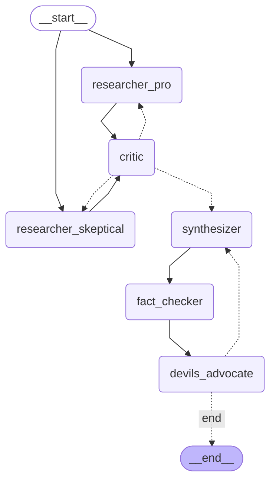

# Agent Graph (static graph)

```mermaid
---
config:
  flowchart:
    curve: linear
---
graph TD;
	__start__([<p>__start__</p>]):::first
	researcher_pro(researcher_pro)
	researcher_skeptical(researcher_skeptical)
	critic(critic)
	synthesizer(synthesizer)
	fact_checker(fact_checker)
	devils_advocate(devils_advocate)
	__end__([<p>__end__</p>]):::last
	__start__ --> researcher_pro;
	__start__ --> researcher_skeptical;
	critic -.-> researcher_pro;
	critic -.-> researcher_skeptical;
	critic -.-> synthesizer;
	devils_advocate -. &nbsp;end&nbsp; .-> __end__;
	devils_advocate -.-> synthesizer;
	fact_checker --> devils_advocate;
	researcher_pro --> critic;
	researcher_skeptical --> critic;
	synthesizer --> fact_checker;
	classDef default fill:#f2f0ff,line-height:1.2
	classDef first fill-opacity:0
	classDef last fill:#bfb6fc

```
